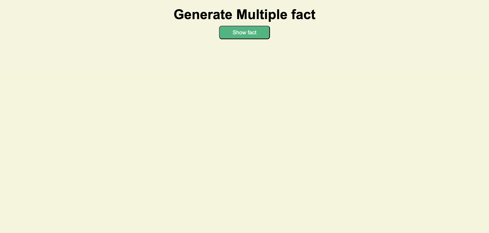

# 🌍 Random Facts Generator

A simple and interactive web application that fetches fascinating random facts from a public API using JavaScript's **Fetch API**. Click the button to discover a new interesting fact instantly.

---

## 📸 Preview



---

## 🚀 Live Demo

🔗 https://your-live-demo-link.com

---

## 📂 GitHub Repository

🔗 https://github.com/CodeNexus456/Genearte-Random-fact-App.git

---

## ✨ Features

- 🌍 Generate random facts instantly
- ⚡ Fast API integration using Fetch API
- 📱 Fully responsive design
- 🎨 Clean and modern user interface
- 🔄 Unlimited random facts
- ❌ Graceful error handling
- 🖱️ One-click fact generation
- 📚 Learn something new every click

---

## 🛠️ Technologies Used

- HTML5
- CSS3
- JavaScript (ES6)
- Fetch API
- REST API

---

## 📁 Project Structure

```
Random-Facts-Generator/
│
├── index.html
├── style.css
├── script.js
├── preview.png
└── README.md
```

---

## 🔗 API Used

### Useful Facts API

https://catfact.ninja/fact

### Example Response

```json
{
  "fact": "Cats have over 20 muscles that control their ears.",
  "length": 48
}
```

---

## ⚙️ How It Works

1. Open the application.
2. Click the **Generate Fact** button.
3. JavaScript sends a request to the API.
4. The API returns a random fact in JSON format.
5. The fact is displayed instantly on the screen.
6. Repeat to discover more interesting facts.

---

## 💻 Installation

### Clone the repository

```bash
git clone https://github.com/your-username/random-facts-generator.git
```

### Navigate to the project folder

```bash
cd random-facts-generator
```

### Open the project

Simply open `index.html` in your browser or run it using **Live Server** in VS Code.

---

## 📚 Concepts Practiced

- Fetch API
- Async/Await
- Promises
- JSON Parsing
- DOM Manipulation
- Event Handling
- Error Handling
- Responsive Web Design

---

## 🚀 Future Improvements

- 🌐 Multiple Fact Categories
- ❤️ Save Favorite Facts
- 📋 Copy Fact to Clipboard
- 🔊 Text-to-Speech
- 🌙 Dark & Light Theme
- 📤 Share Facts on Social Media
- 📖 Fact History
- 🎲 Auto Generate Facts


## 👨‍💻 Author

**Suraj Kumar**

- GitHub: https://github.com/CodeNexus456

---

## ⭐ Support

If you like this project, please give it a **⭐ Star** on GitHub.

---

## 📄 License

This project is licensed under the **MIT License**.

---

### 💡 Learn Something New Every Click!